```mermaid
flowchart TB
    subgraph user_interface["User Interface"]
        vscode_client["VS Code + Copilot"]
        prompt_entry["User Prompt Entry"]
    end

    subgraph mcp_layer["MCP Protocol & Orchestration"]
        mcp_server["FastMCP Server (Python)"]
        langgraph_orch["LangGraph Workflow"]
        etl_state["ETL State Management"]
    end

    subgraph agent_layer["Agent Layer (Databricks Claude 4.5)"]
        planner_agent["PlannerAgent (Claude)"]
        codegen_agent["CodeGenAgent (Claude)"]
        reviewer_agent["ReviewerAgent (Claude)"]
        pr_creator_agent["PRCreatorAgent (GitHub API)"]
        executor_agent["ExecutorAgent (Databricks SDK)"]
        context_agent["ContextEnrichmentAgent"]
        summary_agent["SummaryAgent (Claude)"]
    end

    subgraph tools_integration["Python Integration & External APIs"]
        databricks_tools["Databricks Tools (SDK, SQL)"]
        github_tools["GitHub Tools (REST, GitPython)"]
        medallion_tools["Medallion Utils (SQL Generation)"]
        context_tools["Context Tools (Schema, Analysis)"]
    end

    subgraph databricks_infra["Databricks Workspace"]
        workspace["Workspace / Serverless Infra"]
        foundation_model_api["Foundation Model API<br/>Claude Sonnet 4.5 Endpoint"]
        sql_warehouse["SQL Warehouse (Serverless)"]
        delta_tables["Delta Lake Tables (Bronze/Silver/Gold)"]
        unity_catalog["Unity Catalog"]
    end

    subgraph github_vcs["GitHub Version Control"]
        github_repo["Repository"]
        github_pr["Pull Requests"]
        github_ci["Security & Approval"]
    end

    subgraph storage["Medallion Data Layers"]
        bronze_table["Bronze Table (Raw)"]
        silver_table["Silver Table (Clean)"]
        gold_table["Gold Table (Aggregate)"]
    end

    subgraph config["Configuration"]
        env_vars[".env File"]
        rules_txt["rules.txt"]
    end

    %% USER TO INTERFACE
    vscode_client --> prompt_entry
    prompt_entry --> mcp_server

    %% CONFIGURATION
    env_vars --> mcp_server
    rules_txt --> mcp_server

    %% MCP to ORCHESTRATION
    mcp_server --> langgraph_orch
    mcp_server --> etl_state
    etl_state <--> langgraph_orch

    %% Orchestrator calls agents in sequence
    langgraph_orch --> planner_agent
    planner_agent --> codegen_agent
    codegen_agent --> reviewer_agent
    reviewer_agent -.-> pr_creator_agent
    pr_creator_agent --> executor_agent
    executor_agent --> context_agent
    context_agent -.-> planner_agent
    context_agent --> summary_agent
    summary_agent --> mcp_server

    %% AGENTS to TOOLS
    planner_agent --> databricks_tools
    codegen_agent --> medallion_tools
    reviewer_agent --> databricks_tools
    pr_creator_agent --> github_tools
    executor_agent --> databricks_tools
    context_agent --> context_tools

    %% DATABRICKS: Model API and SQL Warehouse
    planner_agent --> foundation_model_api
    codegen_agent --> foundation_model_api
    reviewer_agent --> foundation_model_api
    summary_agent --> foundation_model_api

    executor_agent --> sql_warehouse
    databricks_tools --> sql_warehouse
    medallion_tools --> sql_warehouse
    context_tools --> sql_warehouse
    sql_warehouse --> delta_tables
    delta_tables --> unity_catalog

    %% DATA FLOW Bronze → Silver → Gold
    bronze_table --> silver_table
    silver_table --> gold_table

    %% Delta tables backed by physical tables
    bronze_table --> delta_tables
    silver_table --> delta_tables
    gold_table --> delta_tables

    %% CONTEXT ENRICHMENT
    bronze_table -.-> context_agent
    silver_table -.-> context_agent
    gold_table -.-> context_agent

    %% PR Creator → GitHub
    pr_creator_agent --> github_pr
    github_pr --> github_repo
    github_repo --> github_ci
    github_pr -.-> executor_agent

    %% Final summary returns to user
    summary_agent --> vscode_client
```

# ETL Agentic X MCP - Intelligent Medallion Pipeline

**An AI-driven, multi-agent ETL orchestration system using LangGraph and Databricks Claude Sonnet 4.5**

Transform raw data through Bronze → Silver → Gold layers with intelligent agents that plan, code, review, and execute transformations automatically. Each layer is backed by a GitHub PR with context-aware code generation.

---

## 🎯 Quick Start

### Prerequisites
- Python 3.12+
- Databricks workspace with serverless SQL warehouse
- GitHub repository with PAT token
- Databricks personal access token

### Installation

```bash
# Clone and install
git clone <your-repo>
cd ETLAgenticXMCP

# Configure environment
cp .env.example .env
# Edit .env with your credentials

# Install dependencies
pip install -r requirements.txt
```

### Run the Pipeline

```python
from graph_workflow import MEDALLION_PIPELINE

# Execute full Bronze → Silver → Gold transformation
result = MEDALLION_PIPELINE.invoke({
    "user_query": "Clean weather data and create daily city aggregations",
    "source_table": "samples.accuweather.forecast_daily_calendar_imperial"
})
```

Or use the MCP server for VS Code integration:

```bash
python server.py
```

---

## 🏗️ Architecture Overview



---

## 📊 Pipeline Workflow

### Single Layer Transformation

For each medallion layer (Bronze, Silver, Gold):

```
1. 🎯 PLANNER
   ├─ Analyzes user query & transformation rules
   ├─ Reviews context from previous layer (if available)
   └─ Creates detailed transformation plan

2. 💻 CODE GENERATOR
   ├─ Generates PySpark/SQL code
   ├─ Includes error handling & data quality checks
   └─ Follows medallion best practices

3. 🔍 REVIEWER
   ├─ Validates syntax & logic
   ├─ Checks against rules.txt compliance
   ├─ Generates quality score
   └─ Approves or requests revision

4. 🔗 PR CREATOR (if approved)
   ├─ Creates GitHub PR with generated code
   ├─ Adds documentation & test plans
   └─ Waits for approval & merge

5. ⚡ EXECUTOR (on PR merge)
   ├─ Detects PR merge event
   ├─ Executes transformation on Databricks
   └─ Monitors execution & collects metrics

6. 📈 CONTEXT ENRICHMENT
   ├─ Queries output table schema
   ├─ Analyzes data quality metrics
   ├─ Creates summary for next layer
   └─ Loops back to PLANNER for next layer

7. 📝 SUMMARY GENERATOR (all layers complete)
   ├─ Aggregates execution metrics
   ├─ Generates executive report
   └─ Returns to user
```

### Multi-Layer Intelligence

Each layer receives **real, fresh context** from the previous layer:

```
Bronze Layer
   ↓ [Context: Raw data schema, row counts, data types]
Silver Layer (uses Bronze context)
   ↓ [Context: Cleaned data schema, quality metrics, duplicates removed]
Gold Layer (uses Silver context)
   ↓
Executive Summary
```

---

## 🔧 Core Components

### Agents (`agents/`)

| Agent | Role |
|-------|------|
| **PlannerAgent** | Analyzes requests, creates transformation strategy, enriches from prior context |
| **CodeGenAgent** | Generates PySpark/SQL code with medallion patterns, validation, and error handling |
| **ReviewerAgent** | Validates code quality, syntax, compliance with rules, generates confidence score |
| **PRCreatorAgent** | Creates GitHub PRs with code, documentation, test plans, tracks merge status |
| **ExecutorAgent** | Executes code on Databricks after PR merge, monitors jobs, collects metrics |
| **ContextEnrichmentAgent** | Analyzes layer output, extracts schema/metrics, prepares context for next layer |
| **SummaryAgent** | Generates executive summary with PR links, metrics, and business insights |

### Tools (`tools/`)

| Module | Purpose |
|--------|---------|
| **databricks_tools.py** | Databricks SDK wrapper - SQL execution, warehouse queries, job monitoring |
| **github_tools.py** | GitHub API & GitPython - PR creation, merge detection, repo operations |
| **medallion_tools.py** | SQL template generators - Bronze/Silver/Gold patterns with transformations |
| **context_tools.py** | Schema extraction, data quality analysis, metrics aggregation |

### State Management (`state.py`)

Centralized ETL state tracking:
- Layer progress (completed/remaining)
- PR history with merge status
- Data quality metrics
- Error logging
- Context accumulation across layers

### Orchestration (`graph_workflow.py`)

LangGraph workflow with:
- Conditional routing based on approval status
- Sequential multi-layer processing
- Context enrichment between layers
- Error handling and fallback paths

### MCP Server (`server.py`)

FastMCP integration exposing:
- `run_full_medallion_pipeline()` - Execute complete Bronze→Silver→Gold
- `check_transformation_status()` - Monitor PR/execution status
- `view_transformation_rules()` - Display/manage transformation rules
- Event-driven PR merge detection

---

## 📋 Transformation Rules

Rules are defined in `rules.txt` and applied across all layers:

### Bronze Layer Rules
- ✅ Ingest raw data as-is
- ✅ Add audit metadata (ingestion_timestamp, source_file, row_id)
- ✅ Store in Delta Lake with Change Data Feed
- ✅ No transformations applied

### Silver Layer Rules
- 🧹 Remove duplicates
- 🔤 Standardize data types & text case
- ❌ Remove null critical values
- 📊 Add quality flags (is_valid_record, data_quality_score)
- 🚫 Filter records with score < 0.7
- 📅 Partition by date

### Gold Layer Rules
- 📈 Aggregate by city & country
- 🧮 Calculate derived metrics (comfort_index, etc.)
- 🗂️ Create dimension & fact tables
- 🔍 Z-order cluster on filtered columns
- 📊 Generate trend views (weekly, monthly)

### Data Quality Checks
- Temperature: -50°C to 60°C
- Humidity: 0-100%
- Coordinates: Latitude ±90, Longitude ±180
- Wind/precipitation: ≥ 0
- Outliers: Flag beyond 3σ

---

## 🚀 Key Features

### 🤖 AI-Driven Decision Making
- Claude Sonnet 4.5 powers all agents
- Natural language transformation requests
- Intelligent code generation with error handling
- Adaptive context enrichment

### 🔄 Context-Aware Pipeline
- Each layer reads output from previous layer
- Fresh schema & metrics inform next planning phase
- No hardcoded assumptions - truly adaptive

### 🔗 GitHub-Native Workflow
- One PR per layer transformation
- Automatic merge detection triggers execution
- Full audit trail in Git history
- Security reviews built-in

### 📊 Built-in Quality Assurance
- Automated code review before PR
- Data quality metrics tracked per layer
- Quality score thresholds enforced
- Comprehensive error logging

### ⚡ Serverless & Scalable
- Databricks serverless SQL warehouse
- Auto-scaling executors
- Delta Lake Change Data Feed
- Unity Catalog for governance

### 🎯 Enterprise-Ready
- Multi-layer medallion architecture
- Idempotent transformations
- Comprehensive logging & monitoring
- Compliance-ready data lineage

---

## 📦 Environment Setup

Create `.env` file:

```bash
# Databricks
DATABRICKS_HOST=https://your-workspace.databricks.com
DATABRICKS_TOKEN=dapi2xxxxx
DATABRICKS_WAREHOUSE_ID=xxxxx
DATABRICKS_MODEL_ENDPOINT=databricks-claude-sonnet-4-5

# Model Configuration
MODEL_TEMPERATURE=0.2
MODEL_MAX_TOKENS=4096
MODEL_TOP_P=0.95

# GitHub
GITHUB_TOKEN=ghp_xxxxx
GITHUB_REPO_OWNER=your-username
GITHUB_REPO_NAME=your-repo
GIT_LOCAL_PATH=/path/to/local/repo

# Databricks Defaults
DEFAULT_CATALOG=samples
DEFAULT_SCHEMA=accuweather

# Logging
LOG_LEVEL=INFO
DEBUG_API_CALLS=false
```

---

## 💻 Usage Examples

### Example 1: Full Pipeline Execution

```python
from graph_workflow import MEDALLION_PIPELINE

state = MEDALLION_PIPELINE.invoke({
    "user_query": "Clean weather data and create daily city aggregations",
    "source_table": "samples.accuweather.forecast_daily_calendar_imperial"
})

print(state["executive_summary"])
```

### Example 2: Custom Transformation Rules

Edit `rules.txt` then run:

```bash
python server.py
# Access via VS Code MCP tools
```

### Example 3: Monitor Transformation Status

```python
from server import check_transformation_status

status = await check_transformation_status(pr_number=42)
print(status)
```

### Example 4: View Transformation Rules

```python
from server import view_transformation_rules

rules = await view_transformation_rules()
print(rules)
```

---

## 📈 Pipeline Execution Flow

```
User Query
    ↓
[MCP Server receives request]
    ↓
[Initialize ETLState]
    ↓
┌─ BRONZE LAYER ────────────────────────────────┐
│ Planner → CodeGen → Reviewer → PR → Executor  │
│ [Create bronze_table from source]             │
│ [Enrich context with schema/metrics]          │
└───────────────────────────────────────────────┘
    ↓ [Context: Bronze table schema, row_count]
┌─ SILVER LAYER ────────────────────────────────┐
│ Planner (with Bronze context) → ... → Executor│
│ [Clean & deduplicate bronze_table]            │
│ [Create silver_table with quality flags]      │
│ [Enrich context with quality metrics]         │
└───────────────────────────────────────────────┘
    ↓ [Context: Silver table schema, quality score]
┌─ GOLD LAYER ──────────────────────────────────┐
│ Planner (with Silver context) → ... → Executor│
│ [Aggregate silver_table by dimensions]        │
│ [Create gold_table with derived metrics]      │
└───────────────────────────────────────────────┘
    ↓
[Generate Executive Summary]
    ↓
Return to User with:
  - 3 PR links (Bronze, Silver, Gold)
  - Execution metrics & timing
  - Data quality scores
  - Error logs (if any)
  - Next steps & recommendations
```

---

## 🔍 Monitoring & Debugging

### Enable Debug Logging

```bash
# In .env
LOG_LEVEL=DEBUG
DEBUG_API_CALLS=true
```

### Check Execution Logs

```bash
# View server logs
tail -f medallion_etl.log

# Check Git PR history
git log --oneline | grep "medallion\|etl"
```

### Monitor Databricks Jobs

- Open Databricks workspace
- Navigate to Workflows → view executed notebooks
- Check job runs for performance metrics

---

## 📚 File Structure

```
ETLAgenticXMCP/
├── agents/                      # AI-powered agents
│   ├── planner_agent.py         # Transformation planning
│   ├── codegen_agent.py         # SQL/PySpark generation
│   ├── reviewer_agent.py        # Code quality review
│   ├── pr_creator_agent.py      # GitHub PR management
│   ├── executor_agent.py        # Databricks execution
│   ├── context_enrichment_agent.py  # Context extraction
│   └── summary_agent.py         # Report generation
├── tools/                       # External integrations
│   ├── databricks_tools.py      # Databricks SDK wrapper
│   ├── github_tools.py          # GitHub API & GitPython
│   ├── medallion_tools.py       # SQL generators
│   └── context_tools.py         # Schema & metrics
├── graph_workflow.py            # LangGraph orchestration
├── state.py                     # ETL state definition
├── server.py                    # FastMCP server
├── main.py                      # CLI entry point
├── rules.txt                    # Transformation rules
├── requirements.txt             # Dependencies
└── .env.example                 # Environment template
```

---

## 🛠️ Dependencies

- **langgraph** - Multi-agent orchestration
- **langchain** - LLM framework
- **databricks-langchain** - Databricks integration
- **databricks-sdk** - Databricks API client
- **fastmcp** - MCP protocol server
- **gitpython** - Git operations
- **requests** - HTTP client
- **pydantic** - Data validation

---

## 🤝 Contributing

1. Fork the repository
2. Create feature branch: `git checkout -b feature/your-feature`
3. Commit changes: `git commit -am 'Add feature'`
4. Push to branch: `git push origin feature/your-feature`
5. Submit pull request

---

## 📄 License

MIT License - See LICENSE file for details

---

## 📞 Support

For issues, questions, or feature requests:
- Open a GitHub issue
- Check existing documentation in `rules.txt`
- Review agent logs for debugging

---

**Built with ❤️ by the Data Engineering Team**  
*Powered by Databricks Claude Sonnet 4.5 & LangGraph*